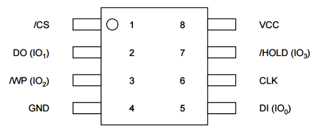
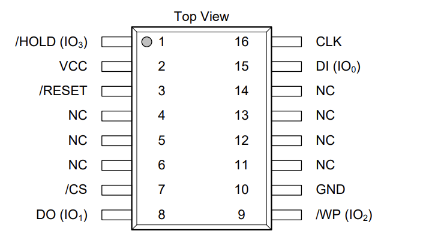

# IoTBoardPentest
## Programming
### Linux
[Tham khảo](https://eblot.github.io/pyftdi/installation.html)
### Window 
Công cụ [zadig](https://zadig.akeo.ie/) cho phép thay đổi driver
1. Chạy công cụ zadig
2. Chọn `Options/List All Devices` và bỏ chọn `Options/Ignore Hubs or Composite Parents`
3. Chuyển Driver của từng interface RS2232H sang `libusb-win32` chọn `interface 0` trước rồi tới `interface 1`
4. Chọn `Replace Driver`

### Cài Thư Viện Lập Trình
```
pip3 install pyftdi
```

Kiểm tra giao tiếp nhận diện với board

```
python3  # or 'python' on Windows
from pyftdi.ftdi import Ftdi
Ftdi.show_devices()
```

```
# FT2232
ftdi://ftdi:2232/1            (Dual RS232-HS)
ftdi://ftdi:2232/2            (Dual RS232-HS)
```

## DUMP FLASH
### SPI - SOP/SOIC8, SOP/SOIC16, DFN8, QFN8, WSON8 - 150mil, 200mil, 300mil.
Board hỗ trợ giao tiếp SPI cho read/write cho phép đọc các loại chip SPI như: SOP/SOIC8, SOP/SOIC16, DFN8, QFN8, WSON8 - 150mil, 200mil, 300mil.





#### Sử Dụng Công Cụ flashroom trên Linux
```
flashrom 
```

#### Sử Dụng `flashtool.py`` cho chip mới mà flashrom chưa hỗ trợ trên window/linux

Liệt kê interface
```
python flashtool -l
```

Dump firmware
```
python flashtool -i [Interface] -d
```

### FLASH NAND TSOP-48
Board hỗ trợ loại NAND FLASH có các chân tín hiệu như sau:


#### Cài Đặt Driver
Công cụ [zadig](https://zadig.akeo.ie/) cho phép thay đổi driver
1. Chạy công cụ zadig
2. Chọn `Options/List All Devices` và bỏ chọn `Options/Ignore Hubs or Composite Parents`
3. Chuyển Driver của từng interface RS2232H sang `libusb-win32` chọn `interface 0` trước rồi tới `interface 1`
4. Chọn `Replace Driver`


`Device Manger > libusb...`


#### Kiểm Tra `pyFtdi` Giao Tiếp Với Board

```
python3  
from pyftdi.ftdi import Ftdi
Ftdi.show_devices()
```
####  Sử Dụng Công Cụ `Yand` Dump Firmware
```
git clone https://github.com/conchyliculture/Yand
cd Yand
python ./cli/yand_cli.py -r -f firmware_OOB.bin 
```

Trường hợp chưa có thông tin về CHIP FLASH bạn tự định nghĩa như sau:
```
yand.errors.YandException: Warning: Could not read ONFI info. Please provide geometry
Flash returned "98dc9115"
```
```
python .\cli\yand_cli.py -P 2048,64 -B 64 -K 128  -r -f test1.bin
```
Tham khảo [Yand](https://github.com/conchyliculture/Yand/tree/master)

Ghi raw file vào Flash. Nguyên tắc phải xóa trước khi ghi mỗi lần sẽ xóa 1 block. (Không chịu trách nhiệm cho việc ghi vào flash)
```
python .\cli\yand_cli.py -P 2048,64 -B 64 -K 129  -w -f test.bin
```